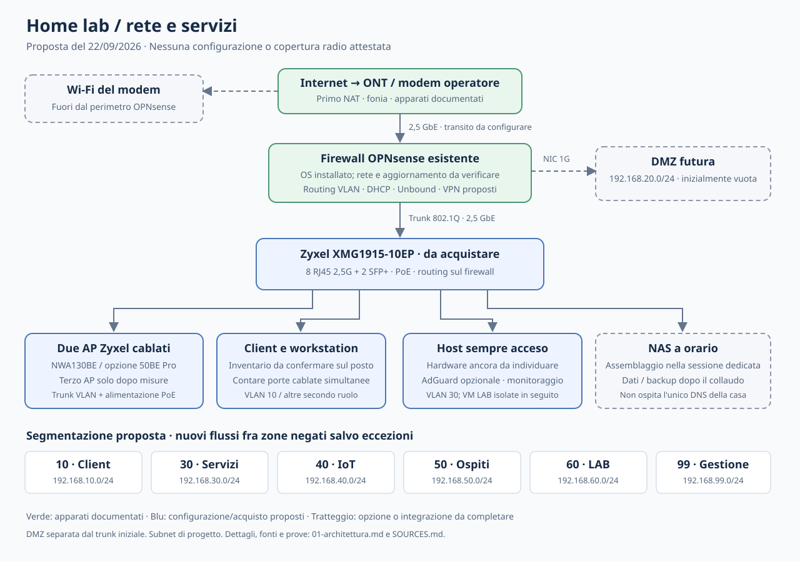
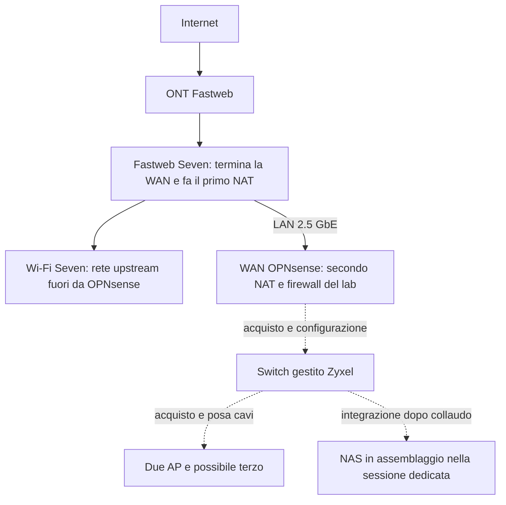
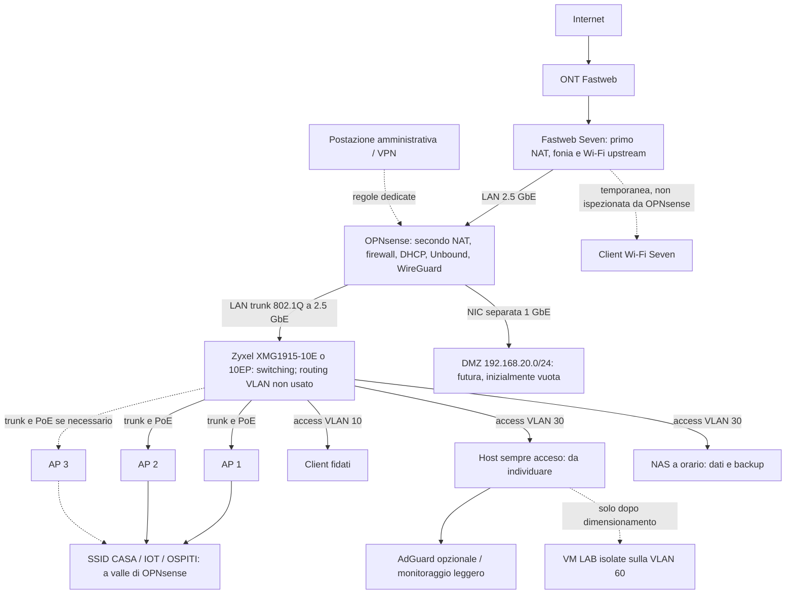
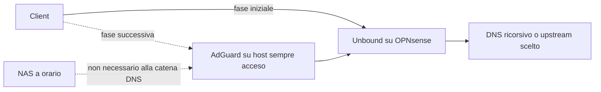

# Architettura proposta e diagrammi

[Apri il diagramma vettoriale](topologia-proposta.svg), leggibile nel browser e stampabile senza perdere definizione. I diagrammi Mermaid qui sotto ne dettagliano stati e flussi.

Ritorno allo [studio](README.md). Stato e vincoli derivano dal [verbale OPNsense](../../verbale-installazione-opnsense.md), dalla [topologia preesistente](../../../.claude/context/diagrams/topologia-di-rete.md) e dal piano NAS. Le subnet seguenti sono proposte private, non indirizzi pubblici o prova di configurazione eseguita. La versione OPNsense installata nel verbale e' storica: prima di collegarla stabilmente si verifica il percorso di aggiornamento supportato e si esporta la configurazione.

## Stato documentato e bersaglio

E' documentata la linea con modem operatore obbligato, l'IP pubblico statico e l'installazione del firewall su i3 di settima generazione, 8 GB RAM, SSD 120 GB, una NIC Gigabit e due TP-Link TX201 a 2,5 GbE. La catena di riferimento diventa ONT -> Seven -> OPNsense: il collegamento diretto ONT -> firewall resta non verificato sulla linea reale e non costituisce il percorso di base. Non e' documentato un collaudo del firewall in transito. Il doppio NAT resta il vincolo locale di progetto, senza estenderlo a tutte le linee FTTH. Il Wi-Fi del Seven e' esterno al perimetro OPNsense finche' non viene migrato agli access point a valle.

Nel diagramma operativo proposto la rete essenziale e' indipendente dal NAS. Le linee rappresentano collegamenti e funzioni desiderati, non una distribuzione gia' attiva.

La DMZ e' qui una porta fisica separata e non viene contemporaneamente duplicata come VLAN 20 sul trunk. Un eventuale consolidamento futuro sullo switch richiede una revisione esplicita. Per l'host con VM LAB si usa un trunk limitato alle VLAN necessarie e bridge virtuali distinti; la porta access disegnata rappresenta il caso iniziale con soli servizi. Non collegare una VM bersaglio contemporaneamente al bridge fidato. La Wi-Fi del Seven resta una rete upstream: OPNsense non ne vede i flussi e non puo' applicare le sue policy a quei client. E' una scelta transitoria accettabile per dispositivi ordinari o legacy, non una protezione completa dell'intera abitazione.

## Segmenti proposti

| Segmento | VLAN | Subnet proposta | Funzione e criterio |
|---|---|---|---|
| WAN OPNsense | nessuna interna | 192.168.1.0/24 | transito dal modem, gestione casa fuori perimetro durante migrazione |
| Client fidati | 10 | 192.168.10.0/24 | PC e telefoni aggiornati; accesso ai servizi selezionati |
| DMZ fisica | non sul trunk iniziale | 192.168.20.0/24 | solo se nasce un servizio pubblico |
| Servizi / storage | 30 | 192.168.30.0/24 | host di servizio e NAS; gestione consentita da amministrazione |
| IoT / legacy | 40 | 192.168.40.0/24 | TV, dispositivi con supporto incerto, eventuali camere |
| Ospiti | 50 | 192.168.50.0/24 | Internet e infrastruttura strettamente necessaria |
| Esperimenti | 60 | 192.168.60.0/24 | test NovaSCM/PXE e pentest su copie sacrificabili |
| Gestione | 99 | 192.168.99.0/24 | switch, AP e interfacce amministrative; nessun SSID pubblico |

Sono sette domini logici contando DMZ e gestione, da attivare progressivamente. Nella prima fase bastano client, IoT/ospiti secondo bisogno e gestione; servizi e LAB arrivano quando esistono gli host. I gateway interni sono sul firewall. Sulla WAN privata va verificata l'opzione OPNsense che blocca reti private, per non scambiare il modem a monte per una sorgente illegittima. IPv6 va progettato con regole equivalenti oppure lasciato non distribuito finche' collaudato; non basta aver filtrato IPv4.

## Contratto fra zone

La politica proposta nega nuove connessioni fra zone salvo le eccezioni della tabella e consente il traffico di risposta degli stati ammessi. Gli alias dei servizi devono contenere destinazioni e porte specifiche, evitando una regola generica client-verso-server.

| Origine | Destinazione | Regola proposta |
|---|---|---|
| VLAN client / IoT / ospiti | DNS e NTP autorizzati | sole porte necessarie; eventuale AdGuard indicato esplicitamente |
| Client fidati | NAS e applicazioni | SMB/HTTPS o protocollo realmente usato; interfacce amministrative escluse |
| Postazione admin o peer VPN amministrativo | gestione e host | HTTPS/SSH e porte strettamente necessarie |
| Ospiti | Internet | accesso Internet, negazione reti locali e interfacce del firewall, isolamento fra client AP |
| IoT | Internet / servizio di controllo | eccezioni per produttore o funzione; nessun accesso generalizzato al NAS |
| LAB | bersagli LAB | ammesso nell'ambito di prova; altre VLAN negate; uscita Internet esplicita se necessaria |
| DMZ | LAN / gestione / storage | negato; eccezioni applicative valutate singolarmente |
| Monitor | apparati | ICMP, SNMP o endpoint autorizzati; nessuna facolta' implicita di amministrazione |

Tra dispositivi nella stessa VLAN il traffico puo' restare sullo switch e non attraversare OPNsense: il firewall di zona non impedisce lateralita' interna. L'isolamento Wi-Fi degli ospiti e i firewall degli host fanno parte del collaudo. Casting e discovery multicast fra VLAN si aggiungono solo per un caso concreto; un relay mDNS generico indebolirebbe la separazione prevista.

## DNS e guasti

Il disegno delle fasi evita di dipendere da un host non ancora disponibile. La ridondanza richiede due servizi su domini di guasto differenti; due container nello stesso NAS non la forniscono. Per un guasto del singolo AdGuard si prepara una procedura di ritorno a Unbound, accettando esplicitamente l'eventuale sospensione temporanea del filtro. Non si introduce un DNS pubblico secondario fingendo che venga usato solo in emergenza. Dettagli nella [nota AdGuard](../../fonti/adguard-home.md).

## Prestazioni, accesso remoto e ripristino

Il link firewall-switch limita il traffico instradato tra VLAN e verso WAN alla sua capacita' condivisa; i 2,5 GbE negoziati non provano throughput utile con IDS o VPN attivi. NAS con NIC Gigabit resta a Gigabit anche su porta multigigabit. Il traffico nella stessa VLAN puo' invece essere commutato localmente. Si misura prima routing di base, poi si valuta Suricata con un insieme limitato di regole, come indicato dalla [documentazione OPNsense](https://docs.opnsense.org/manual/ips.html).

Per l'accesso remoto iniziale si propone [WireGuard su OPNsense](https://docs.opnsense.org/manual/how-tos/wireguard-client.html): sul modem si inoltra la sola porta UDP scelta alla WAN privata del firewall; sul firewall si configura il listener con la regola WAN. Non occorre una seconda traduzione verso un server se l'endpoint VPN e' il firewall stesso. Le applicazioni interne non vengono tutte esposte. La prova si fa da una connessione esterna verificando handshake e servizi autorizzati, non con il port checker TCP degli screenshot.

Prima della migrazione si salvano configurazioni, mappa porte e cablaggio precedente, si mantiene accesso console e una porta di recupero configurata. Si sposta un solo client/AP alla volta, si verifica gestione e segmentazione, poi si migrano gli altri. Il Wi-Fi del modem si disattiva solo dopo il collaudo; lasciarlo attivo richiede dichiararlo esplicitamente come rete fuori dal firewall.
