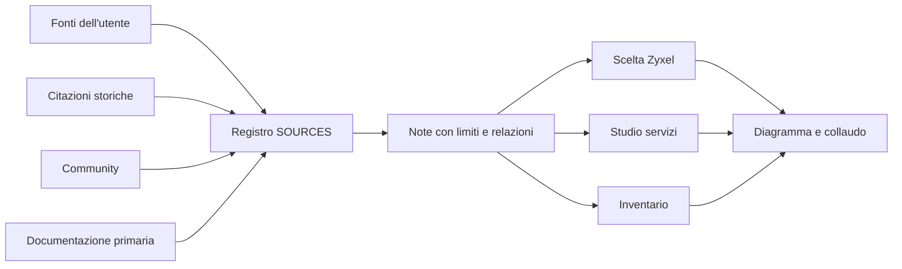

# Mappa delle fonti

Il [registro unico](../../SOURCES.md) contiene riferimenti, provenienza e stato di lettura. Queste note ne sviluppano i collegamenti tecnici; sono scritte a mano e non si rigenerano. Il metodo e' compatibile con la navigazione Obsidian usando i normali collegamenti Markdown. Il [diario di scoperta](ricerca-2026-09-22.json) conserva gli URL emersi dalla ricerca come candidati, senza dichiararli tutti letti.

| Nota | A cosa serve |
|---|---|
| [Strumenti dai tre screenshot](strumenti-da-screenshot.md) | distingue consultazione, diagnostica esterna e protezione web |
| [AdGuard Home](adguard-home.md) | confronta articolo e istruzioni ufficiali con il ruolo di Unbound |
| [Strix](strix.md) | separa software libero, costo del modello e prove su applicazioni del lab |
| [NovaSCM](novascm.md) | ricava funzioni utili per inventario e provisioning |
| [Zyxel e community](zyxel-e-community.md) | specifiche, testimonianze, incompatibilita' e criteri di acquisto |
| [Fastweb, ONT e modem](fastweb-ont-modem.md) | distinzione fra documentazione pubblica e vincolo osservato sulla linea |

